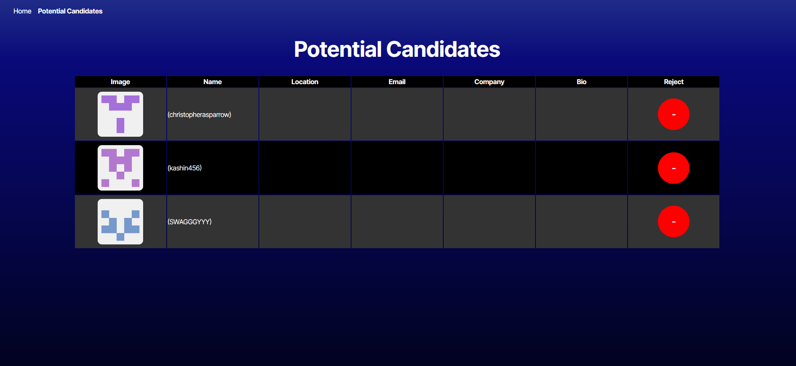

# Github Candidate Search Engine

Deployment Link: https://one3-challenge-z7x9.onrender.com/

Github Repo: https://github.com/IkeAlmighty/13-Challenge

This is a github candidate searcher for hiring teams.

It uses github API to grab random profiles and allows you to
sort through them by adding certain profiles to localstorage
to be displayed in the app.

## Screenshot

